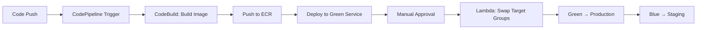

# ECS Blue/Green Deployment 🚀

[](https://aws.amazon.com/ecs/)
[](https://aws.amazon.com/codepipeline/)
[](https://aws.amazon.com/codedeploy/)
[](https://aws.amazon.com/fargate/)

A production-ready implementation of Blue/Green deployment strategy for containerized applications on Amazon ECS, enabling zero-downtime deployments with automated rollback capabilities.

## 📋 Table of Contents

- [Overview](#overview)
- [Architecture](#architecture)
- [Features](#features)
- [Technologies Used](#technologies-used)
- [Prerequisites](#prerequisites)
- [Getting Started](#getting-started)
- [Deployment Process](#deployment-process)
- [Testing](#testing)
- [Rollback Strategy](#rollback-strategy)
- [Monitoring](#monitoring)
- [Troubleshooting](#troubleshooting)
- [Best Practices](#best-practices)
- [Contributing](#contributing)
- [License](#license)

## 🎯 Overview

This project demonstrates a complete CI/CD pipeline for deploying containerized web applications on Amazon ECS using the Blue/Green deployment pattern. Based on the AWS Workshop for Blue/Green Deployments, it provides a reference architecture for implementing zero-downtime deployments with instant rollback capabilities.

### What is Blue/Green Deployment?

Blue/Green deployment is a release management strategy that reduces downtime and risk by running two identical production environments:
- **Blue** - Current production environment serving live traffic
- **Green** - New version environment for testing and staging

Traffic is switched from Blue to Green only after the new version is validated, ensuring zero-downtime deployments.

## 🏗️ Architecture

The solution implements the following architecture:

```
GitHub → CodePipeline → CodeBuild → ECR → ECS (Blue/Green) → ALB → Users
                            ↓
                       CodeDeploy
                            ↓
                    Target Group Swap
```

### Key Components:

- **Application Load Balancer (ALB)**: Routes traffic between Blue and Green environments
  - Port 80: Production traffic (Blue environment)
  - Port 8080: Staging traffic (Green environment)
- **ECS Cluster**: Hosts both Blue and Green services on AWS Fargate
- **Target Groups**: 
  - Blue TG: Associated with production listener (Port 80)
  - Green TG: Associated with staging listener (Port 8080)
- **CodePipeline**: Orchestrates the entire CI/CD workflow
- **CodeBuild**: Builds Docker images and pushes to ECR
- **CodeDeploy**: Manages the Blue/Green traffic shift
- **ECR**: Stores container images
- **CloudWatch**: Monitoring and logging

## ✨ Features

- ✅ **Zero-Downtime Deployments**: Seamless traffic switching between environments
- ✅ **Instant Rollback**: One-click rollback to previous stable version
- ✅ **Automated CI/CD Pipeline**: Fully automated from code commit to production
- ✅ **Infrastructure as Code**: CloudFormation templates for reproducible infrastructure
- ✅ **Traffic Validation**: Test new versions on port 8080 before production release
- ✅ **Manual Approval Gate**: Human verification before production deployment
- ✅ **Container Orchestration**: Leverages ECS Fargate for serverless container management
- ✅ **Target Group Tagging**: Clear identification of production vs staging environments
- ✅ **Automated Health Checks**: ALB health checks ensure only healthy targets receive traffic

## 🛠️ Technologies Used

| Technology | Purpose |
|------------|---------|
| AWS ECS Fargate | Container orchestration (serverless) |
| AWS CodePipeline | CI/CD orchestration |
| AWS CodeBuild | Docker image building |
| AWS CodeDeploy | Blue/Green deployment automation |
| AWS ECR | Container registry |
| Application Load Balancer | Traffic routing and distribution |
| AWS Lambda | Target group swap automation |
| CloudFormation | Infrastructure as Code |
| CloudWatch | Monitoring and logging |
| VPC | Network isolation |

## 📋 Prerequisites

Before deploying this solution, ensure you have:

1. **AWS Account** with appropriate permissions
2. **AWS CLI** installed and configured
   ```bash
   aws --version
   aws configure
   ```
3. **GitHub Account** and a forked repository of your application
4. **GitHub Personal Access Token** with repo permissions
5. **S3 Bucket** for storing CloudFormation templates
6. **Docker** installed (for local testing)

### Required IAM Permissions

Your AWS user/role needs:
- ECS full access
- CodePipeline full access
- CodeBuild full access
- CodeDeploy full access
- ECR full access
- CloudFormation full access
- Lambda full access
- S3 access
- VPC and networking permissions

## 🚀 Getting Started

### Step 1: Clone the Repository

```bash
git clone https://github.com/John095/ecs-blue-green-deploy.git
cd ecs-blue-green-deploy
```

### Step 2: Fork the Sample Application

Fork the ECS sample application to your GitHub account:
```
https://github.com/aws-samples/ecs-sample-app
```

### Step 3: Prepare S3 Bucket

Create an S3 bucket for CloudFormation templates:
```bash
aws s3 mb s3://your-cloudformation-bucket-name --region us-east-1
```

Upload the templates:
```bash
aws s3 sync ./templates s3://your-cloudformation-bucket-name/
```

### Step 4: Deploy Infrastructure

Deploy the main CloudFormation stack:

```bash
aws cloudformation deploy \
  --stack-name ecs-blue-green-deployment \
  --template-file ecs-blue-green-deployment.yaml \
  --capabilities CAPABILITY_NAMED_IAM \
  --parameter-overrides \
    GitHubUser=YOUR_GITHUB_USERNAME \
    GitHubToken=YOUR_GITHUB_TOKEN \
    GitHubRepo=ecs-sample-app \
    TemplateBucket=your-cloudformation-bucket-name
```

### Step 5: Wait for Stack Creation

Monitor the stack creation:
```bash
aws cloudformation describe-stacks \
  --stack-name ecs-blue-green-deployment \
  --query 'Stacks[0].StackStatus'
```

This process takes approximately 15-20 minutes.

## 📦 Deployment Process

### Phase 1: Infrastructure Setup

1. **VPC Creation**: Creates network infrastructure
2. **CodePipeline Setup**: Establishes CI/CD pipeline
3. **CodeBuild Project**: Creates Docker build environment
4. **Lambda Functions**: Deploys target group swap automation

### Phase 2: Application Deployment

1. **ALB Configuration**: Creates Application Load Balancer with two listeners
2. **Target Groups**: Sets up Blue and Green target groups
3. **ECS Service**: Deploys initial Blue and Green services (identical versions)

### Continuous Deployment Workflow



### Pipeline Stages

1. **Source**: Detects changes in GitHub repository
2. **Build**: 
   - Builds Docker image
   - Pushes to Amazon ECR
   - Outputs build.json artifact
3. **Deploy to Green**:
   - Deploys new image to Green service
   - Runs health checks
4. **Manual Approval** ⏸️:
   - Test Green environment at `http://ALB_DNS:8080`
   - Approve or Reject deployment
5. **Traffic Shift**:
   - Lambda swaps target groups
   - Blue becomes staging (port 8080)
   - Green becomes production (port 80)

## 🧪 Testing

### Test Green Environment (Before Production)

Access the Green environment on port 8080:
```bash
# Get ALB DNS name
ALB_DNS=$(aws cloudformation describe-stacks \
  --stack-name ecs-blue-green-deployment \
  --query 'Stacks[0].Outputs[?OutputKey==`LoadBalancerUrl`].OutputValue' \
  --output text)

# Access Green environment
curl http://$ALB_DNS:8080
# or visit in browser: http://ALB_DNS:8080
```

### Validate Production Environment

After approval and traffic shift:
```bash
curl http://$ALB_DNS
# or visit in browser: http://ALB_DNS
```

### Example: Trigger a Deployment

1. Clone your forked application:
   ```bash
   git clone https://github.com/YOUR_USERNAME/ecs-sample-app.git
   cd ecs-sample-app
   ```

2. Make a change (e.g., update background color):
   ```bash
   # Edit src/index.php
   # Change background-color to #20E941 (green)
   vim src/index.php
   ```

3. Commit and push:
   ```bash
   git add .
   git commit -m "Change background to green"
   git push origin main
   ```

4. Monitor CodePipeline in AWS Console
5. When prompted, review and approve the deployment
6. Verify the new version is live

## ↩️ Rollback Strategy

### Instant Rollback

If issues are detected in production:

1. Navigate to CodePipeline in AWS Console
2. Click **"Review"** on the latest pipeline execution
3. Click **"Approve"** again

This triggers the Lambda function to swap target groups back:
- Green becomes staging (port 8080)
- Blue returns to production (port 80)

### Identify Active Environment

Check Target Group tags to identify production:

```bash
aws elbv2 describe-tags \
  --resource-arns $(aws elbv2 describe-target-groups \
    --query 'TargetGroups[*].TargetGroupArn' \
    --output text)
```

Look for tag: `IsProduction: true`

## 📊 Monitoring

### CloudWatch Metrics

Monitor key metrics:
- ECS Service CPU/Memory utilization
- ALB request count and latency
- Target health status
- CodePipeline execution status

```bash
# View ECS service metrics
aws cloudwatch get-metric-statistics \
  --namespace AWS/ECS \
  --metric-name CPUUtilization \
  --dimensions Name=ServiceName,Value=blue-service \
  --start-time 2026-01-11T00:00:00Z \
  --end-time 2026-01-12T00:00:00Z \
  --period 3600 \
  --statistics Average
```

### CloudWatch Logs

Access application logs:
```bash
aws logs tail /ecs/blue-green-deployment --follow
```

### Alarms (Optional Enhancement)

Set up CloudWatch alarms for:
- High error rates (5xx responses)
- Unhealthy target count
- High latency

## 🔧 Troubleshooting

### Common Issues

#### Pipeline Fails at Build Stage
- **Cause**: Docker build errors or missing dependencies
- **Solution**: Check CodeBuild logs in CloudWatch
  ```bash
  aws codebuild batch-get-builds --ids <build-id>
  ```

#### Deployment Stuck in Pending
- **Cause**: Health checks failing on new tasks
- **Solution**: 
  - Check ECS task logs
  - Verify security group rules allow ALB → ECS traffic
  - Ensure health check path is correct

#### Can't Access Green Environment
- **Cause**: Security group or network configuration
- **Solution**: Verify security group allows inbound traffic on port 8080

#### Lambda Swap Function Fails
- **Cause**: IAM permissions or target group issues
- **Solution**: Check Lambda execution logs in CloudWatch

### Debug Commands

```bash
# Check ECS service status
aws ecs describe-services \
  --cluster ecs-cluster-name \
  --services blue-service green-service

# Check target health
aws elbv2 describe-target-health \
  --target-group-arn <target-group-arn>

# View recent pipeline executions
aws codepipeline list-pipeline-executions \
  --pipeline-name ecs-blue-green-pipeline
```

## 💡 Best Practices

1. **Always Test Green Before Approval**: Access port 8080 to validate new deployment
2. **Monitor Metrics**: Watch CloudWatch metrics during and after deployment
3. **Implement Smoke Tests**: Add automated testing in the pipeline
4. **Use Semantic Versioning**: Tag Docker images with version numbers
5. **Set Up Alerts**: Configure SNS notifications for pipeline failures
6. **Document Changes**: Use detailed commit messages
7. **Regular Backups**: Keep previous Docker images in ECR
8. **Security**: Regularly update base images and scan for vulnerabilities
9. **Cost Optimization**: Use Fargate Spot for non-production workloads
10. **Disaster Recovery**: Test rollback procedures regularly

## 🎓 Learning Resources

- [AWS ECS Developer Guide](https://docs.aws.amazon.com/ecs/)
- [Blue/Green Deployment Pattern](https://martinfowler.com/bliki/BlueGreenDeployment.html)
- [AWS CodePipeline Documentation](https://docs.aws.amazon.com/codepipeline/)
- [ECS Workshop - Blue/Green Deployments](https://ecsworkshop.com/blue_green_deployments/)

## 🤝 Contributing

Contributions are welcome! Please:

1. Fork the repository
2. Create a feature branch (`git checkout -b feature/amazing-feature`)
3. Commit your changes (`git commit -m 'Add amazing feature'`)
4. Push to the branch (`git push origin feature/amazing-feature`)
5. Open a Pull Request

## 📄 License

This project is licensed under the MIT License - see the [LICENSE](LICENSE) file for details.

## 🙏 Acknowledgments

- Based on the [AWS Workshop: Blue/Green Deployments on ECS](https://ecsworkshop.com/blue_green_deployments/)
- Inspired by AWS samples and best practices
- Community contributions and feedback

## 📞 Contact

**John Ndirangu**
- GitHub: [@John095](https://github.com/John095)
- LinkedIn: [Connect with me](https://linkedin.com/in/your-profile)

---

⭐ If you find this project helpful, please give it a star!

**Made with ❤️ for the DevOps Community**
